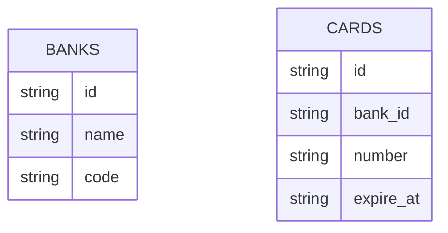

# WIP :wrench:

## OminiDB - SQL Client

**Connection string for connect to OminiDB**

| Field    | Value    |
| -------- | -------  |
| Host     | postgres |
| Port     | 5432     |
| User     | icash    |
| Password | 123456   |

**Credentials**
- User: admin
- Password: admin

## DER

---
## Packages

    Netflix/go-env  - Enviroments variables
    Fiber           - REST API
    Sonic           - JSON Marshal/Unmarshal 
    Snowflake       - Generate id
    Testify         - Tests
    