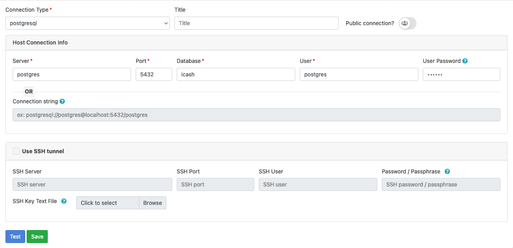
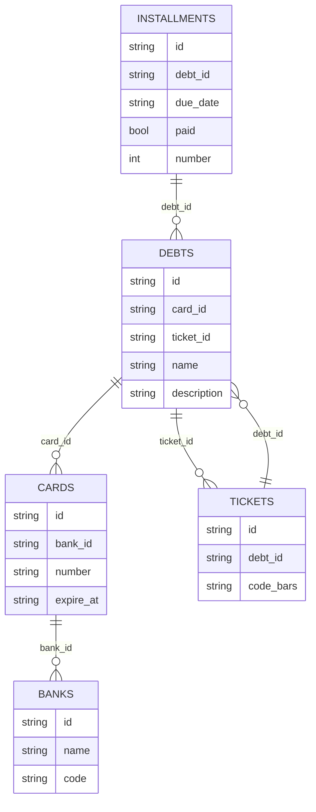

# WIP :wrench:

## OminiDB - SQL Client

### Credentials
> [!NOTE]
> - User: admin
> - Password: admin

### Connection string for connect to OminiDB

| Field      | Value      |
| :--------: | :-------:  |
| Host       | postgres   |
| Port       | 5432       |
| User       | icash      |
| Password   | 123456     |

## Packages

    Netflix/go-env  - Enviroments variables
    Fiber           - REST API
    Sonic           - JSON Marshal/Unmarshal 
    Snowflake       - Generate id
    Testify         - Tests

